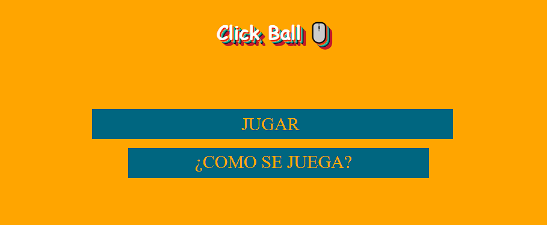
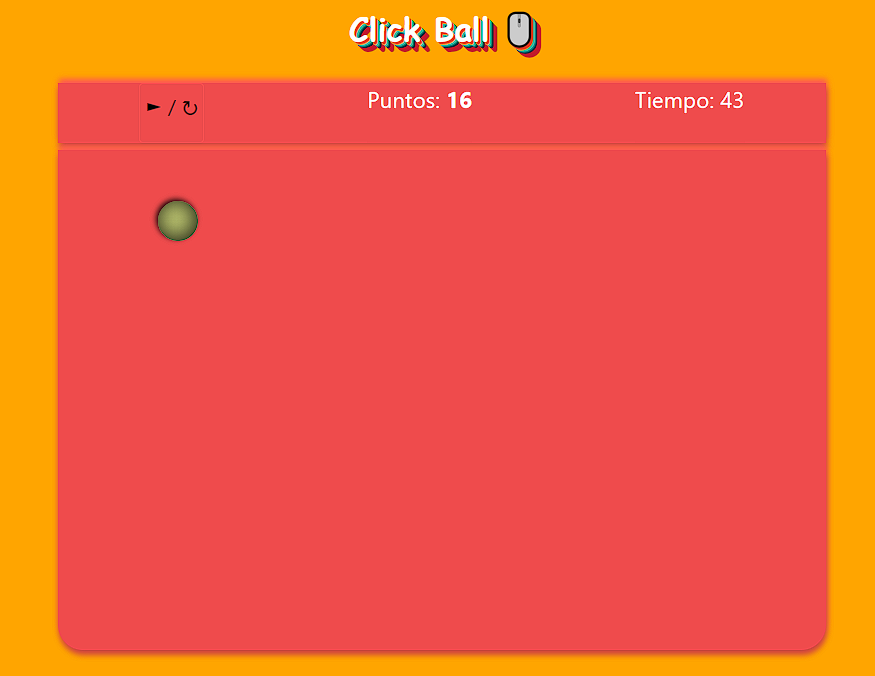

# Click-ball 

El juego original fue desarrollado utilizando SMARTY, JS, CSS y PHP. Incluía funciones de registro e inicio de sesión (implementadas mediante `$_POST` y una base de datos) y seguía una arquitectura de página MVC (Modelo, Vista, Controlador).

Para presentarlo en mi portfolio web, tuve que reestructurarlo y convertirlo en una página estática, eliminando PHP y SMARTY. La versión actual utiliza HTML, CSS, JS y jQuery.

## Capturas de Pantalla

### Menú

### Inicio

### Finalizado

